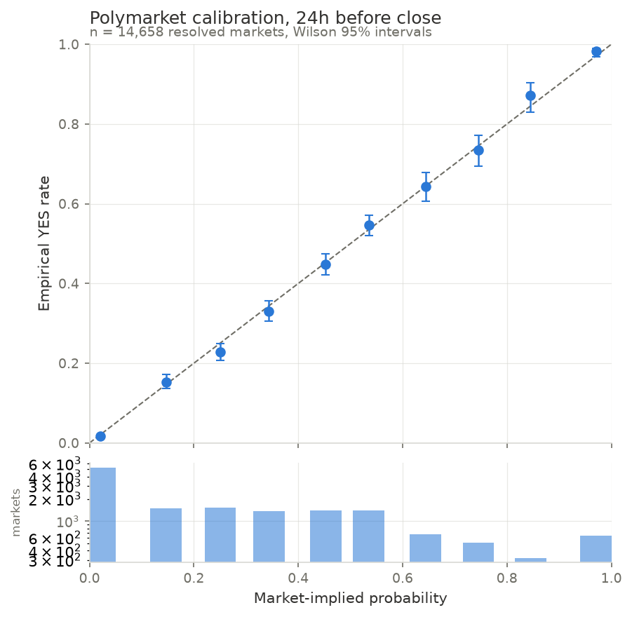
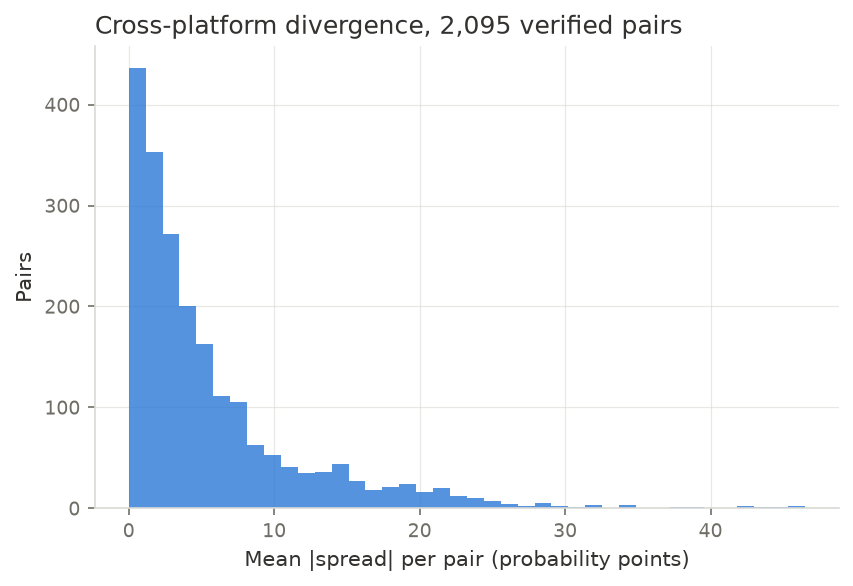
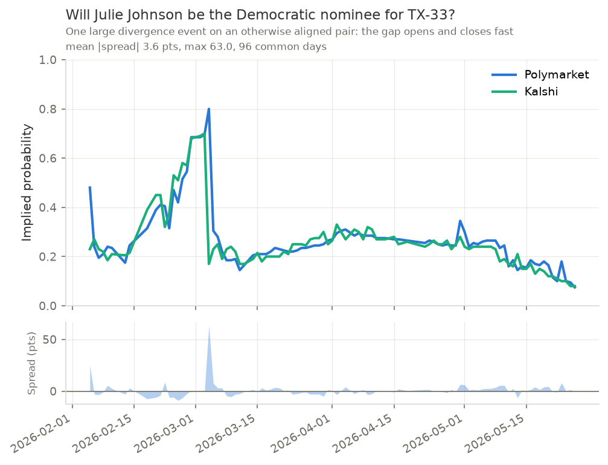

# market-lens

[](https://github.com/anytroops/market-lens/actions/workflows/tests.yml)

**Do prediction markets know what they are talking about, and can you arbitrage the disagreements between them?**

An end-to-end data pipeline and statistical study of roughly 580,000 resolved
binary contracts from Polymarket and Kalshi. It audits how well market prices
work as probability forecasts, matches equivalent contracts across the two
venues, measures how far their prices diverge and how fast the gaps close, and
backtests a fee-adjusted arbitrage strategy to see whether the divergences were
ever exploitable after costs.

Analysis of public data only. No orders were placed, no trading credentials
exist in this project.

## Headline findings

**1. Both platforms are remarkably well calibrated.** When a contract is priced
at 15 cents 24 hours before it closes, it resolves YES about 15% of the time.
The calibration error component of the Brier score is 0.0001 for Polymarket
(n = 14,638) and 0.0002 for Kalshi (n = 10,643), against 0.25 for a forecaster
who always says 50%.



**2. The textbook favorite-longshot bias has nearly vanished.** Classic studies
find longshots badly overpriced. Here, Polymarket contracts averaging 2.1%
implied probability resolved YES 1.8% of the time (95% CI [1.4%, 2.1%], not
significant). Kalshi's averaging 3.1% resolved 2.3% ([1.9%, 2.7%]), a real but
tiny 0.8 percentage point overpricing. The classic effect is directionally
right where it appears at all, and an order of magnitude smaller than the
racetrack literature.

**3. Markets sharpen as resolution approaches.** On identical market sets scored
at both horizons, so composition cannot explain it, Polymarket's Brier score
improves from 0.1344 at 7 days out to 0.1145 at 24 hours, and Kalshi's from
0.0709 to 0.0538. Resolution (discrimination) rises in step.

**4. The two venues disagree constantly, but briefly.** Across 2,022 verified
matched pairs and 49,340 pair-days, the mean absolute spread is 3.9 probability
points, exceeding 5 points on 21% of days and 10 points on 9%. Of 3,414
divergence events, the median half-life is **1 day**: gaps open and close fast.



The averages hide the interesting behaviour. Here both venues track a
news-driven move within a couple of points, then Kalshi reprices decisively
while Polymarket lags a day, opening a 63 point gap that closes almost
immediately:



**5. Apparent arbitrage survives fees on paper, but not scrutiny.** At a
1-point slippage assumption, 899 of 2,095 tradable pairs (43%) showed a
fee-adjusted combined cost below \$1, median edge 3.2 cents and median 74%
annualized. Every one of those 899 trades paid out exactly \$1 at
resolution, which is the check that the matched pairs are real. Raising the slippage assumption to 3 points cuts that to 33% of
pairs. The honest reading is in [LIMITATIONS.md](LIMITATIONS.md): the edge
concentrates in thin, early-life quotes where the displayed price is good for
tens of dollars, not thousands, and Polymarket has no historical order book to
verify depth against. This is a market-microstructure finding, not a trading
strategy.

**6. Measured execution finally settles it.** The backtest could not see
order book depth, so it assumed a 1-point slippage haircut and swept 0 to 3.
Live capture of 120 real books shows Polymarket costs **3.0 points at $50,
7.3 at $200 and 14.7 at $1,000** (Kalshi, whose books are deep, costs 0.02 to
0.66). Re-running the backtest at measured rather than assumed slippage cuts
opportunities from 43% of pairs to **22% at a $200 trade and 12% at $1,000** —
and the original sensitivity sweep never even reached those levels. Combined
with the edge being 6x larger in the thinnest volume quartile, the apparent
arbitrage is an artifact of quoting, not a tradable opportunity.
[reports/paper_trading.md](reports/paper_trading.md).

Full write-up with all numbers: [reports/results.md](reports/results.md).

## Architecture

```
   Polymarket Gamma API            Kalshi trade-api v2
   (metadata, keyset paging)       (series, markets, candlesticks)
            |                                |
            +--------------+-----------------+
                           |
                  ingest/base.py
       rate limiting, exponential backoff, gzip raw archive
       (data/raw/ doubles as a cache: re-runs never re-hit the API)
                           |
                  SQLite (data/marketlens.sqlite)
         markets | prices | matches | headline_markets view
                           |
        +------------------+------------------+---------------+
        |                  |                  |               |
   calibration.py     matching/          divergence.py    backtest.py
   Wilson CIs         blocking +         daily align,     entry rule,
   Brier + Murphy     token_set_ratio    spread stats,    fees, slippage,
   decomposition      + guards +         half-life        hold to resolution
                      mutual best
        |                  |                  |               |
        +------------------+------------------+---------------+
                           |
                  reports/ (tables, figures, CSVs)

   live/  (read-only forward test, no orders, no credentials)
     books.py    walks real order books for a target size
     capture.py  snapshots depth from both venues
     paper.py    logs what the strategy would do, and settles it later
```

Every statistic is a small pure function with a hand-computed unit test.
**179 tests, all passing.**

## Key engineering problems

**Cross-platform entity matching.** The same event trades as "Will the Fed cut
rates in September?" on one venue and "Fed decreases rates at Sept meeting?" on
the other. Fuzzy text similarity alone gave roughly 60% precision even in the
top score band, because `token_set_ratio` scores 100 whenever one title's tokens
are a subset of the other's ("Brazil: 5+ corners" vs "Brazil vs Norway: O/U 6.5
Total Corners"). The failure modes were systematic, so each became a
deterministic rejection rule: numeric tokens must match exactly, max never
matches min, 1st half never matches 2nd half, a bare "A vs B" moneyline only
matches propositions about winning, weather pairs must agree on a city that
Kalshi encodes in the series ticker rather than the title. That lifted measured
precision to roughly 90%, after which every candidate was checked against both
platforms' full resolution rules text.

The final check used no text judgment at all: for every verified pair, do the
two markets' recorded outcomes actually agree the way the pair says they must?
That surfaced 9 bad pairs from three specific causes (generic "both teams to
score" titles matching different fixtures, a shared first name, and a cricket
market matched to football). After fixing those, **0 of 2,507 non-basis-risk
pairs resolve inconsistently**, against roughly 43% expected if pairs were
random. Method and measured accuracy: [reports/matching.md](reports/matching.md).

**Point-in-time discipline.** Every forecast is the last price at or before the
snapshot moment, and the backtest can only enter on data available that day.
Lookahead bias is the fastest way to fake a profitable strategy.

**Silent data artifacts.** Two were found by looking at charts and asking
whether a number was physically possible. Polymarket seeds price history with a
placeholder near 0.50 before a market's first trade, which manufactured 47 cent
"arbitrage" on golf longshots really priced at 0.3 cents; stripping it plus a
guard on single-day jumps above 25 points cut apparent opportunities from 65% of
pairs to 43%. Kalshi's candlesticks carry stale last-trade prints, including a
96 cent trade in a market quoted 8 to 14 cents, which faked a 91 point
divergence. A shared rule now requires a two-sided book tighter than 20 points
before any Kalshi price is believed. That correction **retracted a headline
finding**: Kalshi favorites had looked significantly overpriced, and did not
survive the fix.

## A sixth finding: nothing simple beats the price

A logistic regression on logit(price) plus momentum, category, platform,
and market age fails to improve on the market price at all (paired
log-loss difference -0.00027, t = -0.48). Using log-odds matters: a fitted
coefficient of 1.0 on logit(price) reproduces the market exactly, and the
fit lands at 1.05.

The first version of that model DID beat the market, at t = 5.30. Ablating
one feature group at a time showed the entire gain came from volume, and
the volume field is each market's LIFETIME volume recorded at ingestion,
which is after resolution. Markets that resolve YES dramatically attract
heavy late volume, so the model was reading the future through an
innocuous-looking column. Removing it collapsed the gain to nothing.
Written up in full in [reports/results.md](reports/results.md), because
the catch is more instructive than the result.

## Reproducing

```bash
python3 -m venv .venv && .venv/bin/pip install -e ".[dev]"
```

The tests are self-contained and run against captured fixtures, so they
work immediately on a fresh clone:

```bash
.venv/bin/python -m pytest
```

The analysis needs data, and the 3.6 GB database is not in the repo. To
collect it (several hours, hits both public APIs politely):

```bash
.venv/bin/marketlens run-all
```

Once the raw archive exists in `data/raw/`, re-running is offline and takes
about seven minutes, because ingestion replays the gzipped archive rather
than the APIs:

```bash
.venv/bin/marketlens run-all --skip-ingest
```

Every table and figure in `reports/` is generated by that command, so the
committed outputs can be checked against a rerun.

```bash
.venv/bin/python -m pytest
```

All assumptions (date window, inclusion policy, fee schedules with source links
and retrieval dates, slippage) live in [config.yaml](config.yaml), not in code.
Raw API responses are archived before parsing, so re-runs are free and parsing
bugs never require re-downloading.

## Stack

Python 3.11+, httpx, pandas, numpy, scipy, rapidfuzz, pydantic, typer,
matplotlib, pytest, SQLite. Analytical SQL (joins, window functions, NTILE
terciles) in [sql/example_queries.sql](sql/example_queries.sql).

## Repo map

| Path | What |
|---|---|
| `src/marketlens/ingest/` | API clients, shared retry/cache layer |
| `src/marketlens/db/` | Schema, idempotent upsert loaders |
| `src/marketlens/matching/` | Blocking, fuzzy scoring, compatibility guards |
| `src/marketlens/analysis/` | Calibration, divergence, backtest |
| `reports/` | Findings, generated tables, figures, verification CSVs |
| `LIMITATIONS.md` | Every caveat found, maintained continuously |
| `FUTURE.md` | Scoped-out work and why |
| `WORKLOG.md` | Decision log |
