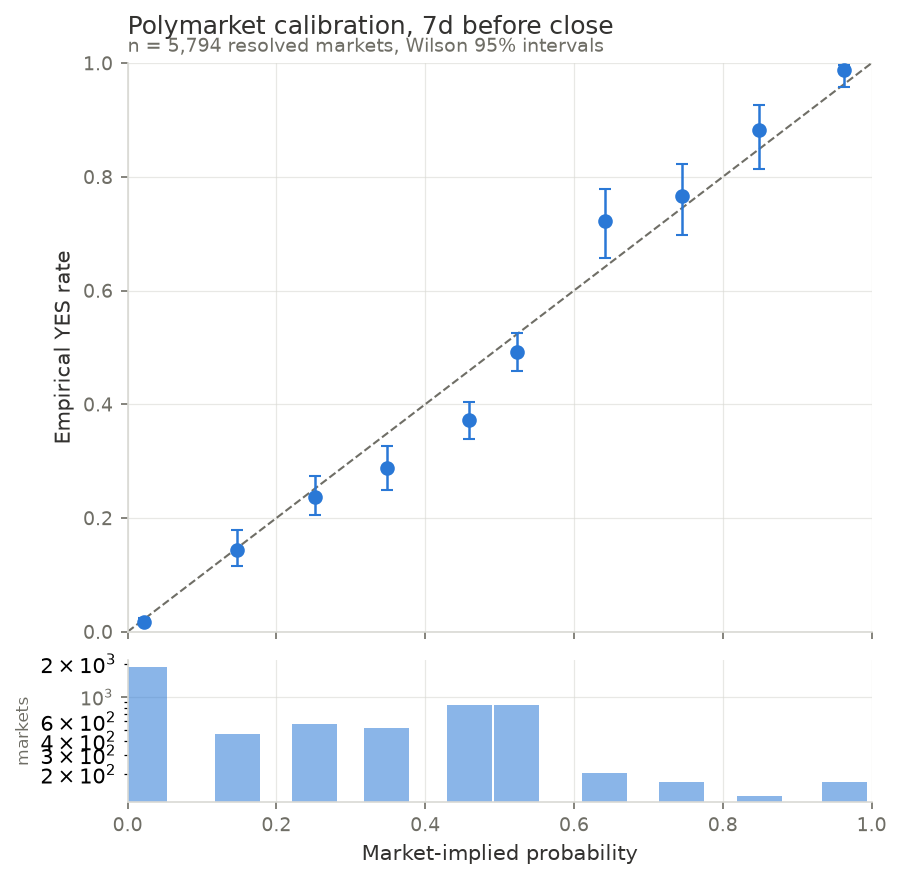
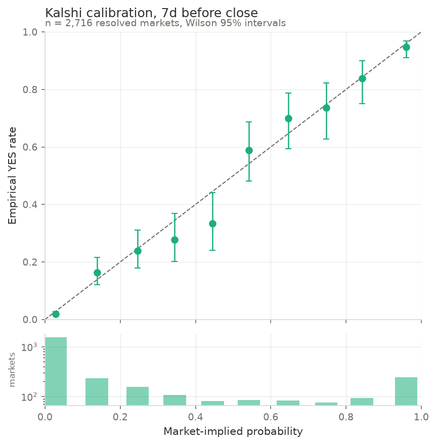
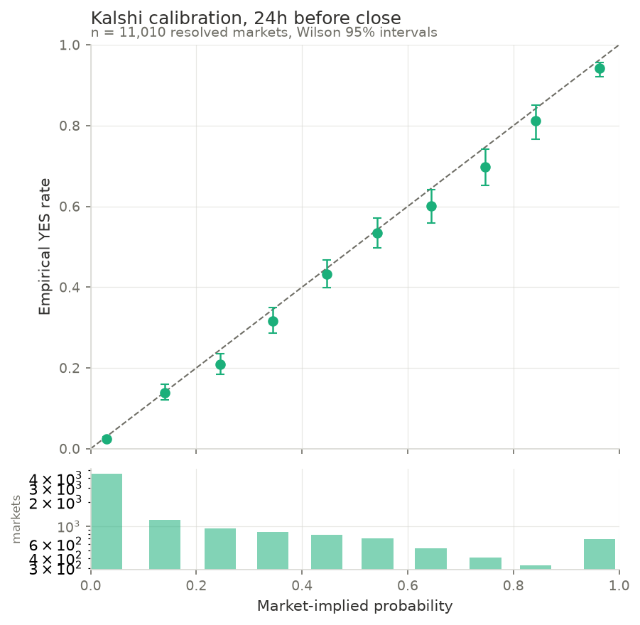

# Results

## Calibration (Phase 3)

Forecast = last market price at the stated horizon before close
(point-in-time, no lookahead). Outcome = 1 when the market's
proposition resolved YES. Kalshi no-trade candles use the bid/ask
midpoint when the closing spread is at most 0.20, else the market
drops out of that horizon's sample.

### Headline table

| Platform | Horizon | N | Brier | Reliability (cal. error) | Resolution | Uncertainty | Base rate |
|---|---|---|---|---|---|---|---|
| polymarket | 7d | 5,794 | 0.1383 | 0.0019 | 0.0682 | 0.2054 | 0.289 |
| polymarket | 24h | 14,866 | 0.1283 | 0.0001 | 0.0773 | 0.2061 | 0.291 |
| kalshi | 7d | 2,716 | 0.0766 | 0.0008 | 0.1032 | 0.1793 | 0.234 |
| kalshi | 24h | 11,010 | 0.1140 | 0.0004 | 0.0825 | 0.1971 | 0.270 |

### Do markets sharpen as resolution approaches? (paired sample)

Same markets scored at both horizons, so composition cannot
explain the difference. Sharpening means higher resolution and a
lower Brier at 24h than at 7d.

| Platform | N (paired) | Brier 7d | Brier 24h | Resolution 7d | Resolution 24h |
|---|---|---|---|---|---|
| polymarket | 5,794 | 0.1383 | 0.1169 | 0.0682 | 0.0881 |
| kalshi | 2,716 | 0.0766 | 0.0582 | 0.1032 | 0.1214 |

### Favorite-longshot bias (24h horizon)

| Platform | Segment | N | Mean implied prob | Empirical YES rate | Wilson 95% CI |
|---|---|---|---|---|---|
| polymarket | longshots (p < 0.10) | 5,294 | 0.021 | 0.018 | [0.014, 0.021] |
| polymarket | favorites (p > 0.90) | 625 | 0.971 | 0.982 | [0.969, 0.990] |
| kalshi | longshots (p < 0.10) | 4,577 | 0.030 | 0.025 | [0.021, 0.030] |
| kalshi | favorites (p > 0.90) | 646 | 0.967 | 0.949 | [0.929, 0.963] |

### Calibration by category (24h horizon, reliability component)

| Platform | Category | N | Brier | Reliability |
|---|---|---|---|---|
| polymarket | crypto | 1,306 | 0.0751 | 0.0012 |
| polymarket | econ | 261 | 0.0870 | 0.0025 |
| polymarket | entertainment | 745 | 0.0512 | 0.0014 |
| polymarket | other | 1,028 | 0.0824 | 0.0008 |
| polymarket | politics | 1,099 | 0.0610 | 0.0019 |
| polymarket | sports | 8,174 | 0.1750 | 0.0002 |
| polymarket | weather | 2,111 | 0.0742 | 0.0013 |
| kalshi | econ | 629 | 0.0651 | 0.0036 |
| kalshi | entertainment | 798 | 0.0632 | 0.0035 |
| kalshi | mentions | 531 | 0.1616 | 0.0019 |
| kalshi | politics | 567 | 0.0344 | 0.0019 |
| kalshi | sports | 7,412 | 0.1280 | 0.0006 |
| kalshi | weather | 1,007 | 0.1066 | 0.0017 |

### Calibration by volume tercile (24h horizon)

| Platform | Tercile | N | Brier | Reliability |
|---|---|---|---|---|
| polymarket | thin | 4,955 | 0.1202 | 0.0016 |
| polymarket | middle | 4,955 | 0.1237 | 0.0002 |
| polymarket | deep | 4,956 | 0.1409 | 0.0009 |
| kalshi | thin | 3,669 | 0.0621 | 0.0029 |
| kalshi | middle | 3,671 | 0.1247 | 0.0009 |
| kalshi | deep | 3,670 | 0.1553 | 0.0007 |
